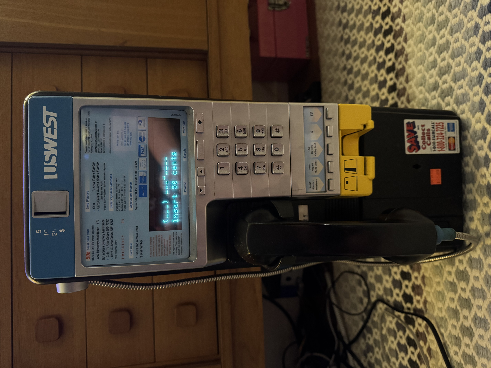

# Millennium Project

The **Millennium Project** breathes new life into the Nortel Millennium public telephone by replacing much of its original electronics with modern hardware and software. The project integrates a Raspberry Pi Zero 2 W, two Arduinos, and a VoIP software stack while retaining all the original hardware, including the display, keypad, coin acceptor, magstripe reader, handset, and ringer speaker.

## Table of Contents

1. [Overview](#overview)
2. [Features](#features)
3. [Directory Structure](#directory-structure)
4. [Setup](#setup)

---

## Overview

This project reimagines the functionality of the Nortel Millennium telephone by combining modern hardware and software while preserving its iconic hardware features:
- **Raspberry Pi Zero 2 W**: Manages the system, runs the VoIP stack, and interfaces with the original hardware.
- **Arduinos**: Control the keypad, display, and other peripherals.
- **Custom PCB**: Consolidates the connections between components.
- **Host Software**: Includes a daemon, systemd configurations, and custom Lua scripts for audio management.
- **Preserved Hardware**: The original display, keypad, coin acceptor, magstripe reader, handset, and ringer speaker are retained and functional.

---

## Features

- **Hardware Integration**: Combines original telephone hardware with modern components for seamless operation.
- **VoIP Capability**: Uses a VoIP software stack for making and receiving calls.
- **Custom PCB**: Designed in KiCad to interface the Raspberry Pi and Arduinos with the original hardware.
- **Host Software**: Manages system services and audio configurations on the Raspberry Pi.
- **Arduino Firmware**: Controls the display, keypad, and other peripherals.
- **Preserved Design**: The original aesthetics and hardware are maintained.

---

## Directory Structure

- **`Arduino/`**: Contains Arduino sketches and a Makefile for building and flashing firmware.
- **`case/`**: Contains 3D model files (`.blend` and `.stl`) for a custom enclosure, if needed.
- **`pcb/`**: Includes KiCad project files and exported manufacturing files for the custom PCB.
- **`host/`**: Contains software for the Raspberry Pi, including a daemon, systemd configurations, and a WirePlumber Lua script.

---

## Setup

### 1. Arduino Firmware
- Navigate to the `Arduino/` directory and follow the instructions in its [README](Arduino/README.md) to build and flash firmware to the microcontrollers.

### 2. PCB
- The PCB files are in the `pcb/` directory. Upload the Gerber files to a PCB fabricator like JLCPCB for manufacturing. See the [pcb README](pcb/README.md) for details.

### 3. Host Software
- Build and configure the software on the Raspberry Pi Zero 2 W:
  - Compile the daemon using the provided `Makefile`.
  - Install the WirePlumber Lua script as described in the [host README](host/README.md).
  - Set up systemd user services for automated startup.

## Resources

This project draws on several resources for understanding and interfacing with the Nortel Millennium telephone's hardware:

1. **General Millennium Payphone Documentation**  
   The [Millennium Payphone Wiki](https://wiki.muc.ccc.de/millennium:start) provides extensive documentation on the phone's hardware and protocols.  
   - **Coin Validator Protocol**: Used the documented higher-level protocol to interface with the coin validator.  
   - **EEPROM Data**: Referenced for configuring the coin validator to accept Canadian currency.

2. **Display Documentation**  
   A detailed discussion on the Noritake CU20026SCPB-T23A VFD display can be found in this [HardForum thread](https://hardforum.com/threads/noritake-cu20026scpb-t23a-20-x-2-vfd-modulel.1132806/). This was essential for understanding and controlling the display.

3. **Device Pinouts**  
   The [New Fire Millennium Payphone Page](http://www.newfire.org/payphones/millennium/) includes pinout diagrams for various components, which were critical when developing the Arduino sketches.

4. **Millennium Phone Source**  
   The Millennium phone used in this project was sourced from [Ballard Reuse](https://ballardreuse.com/) in Seattle, a store specializing in salvaged and reusable materials.
