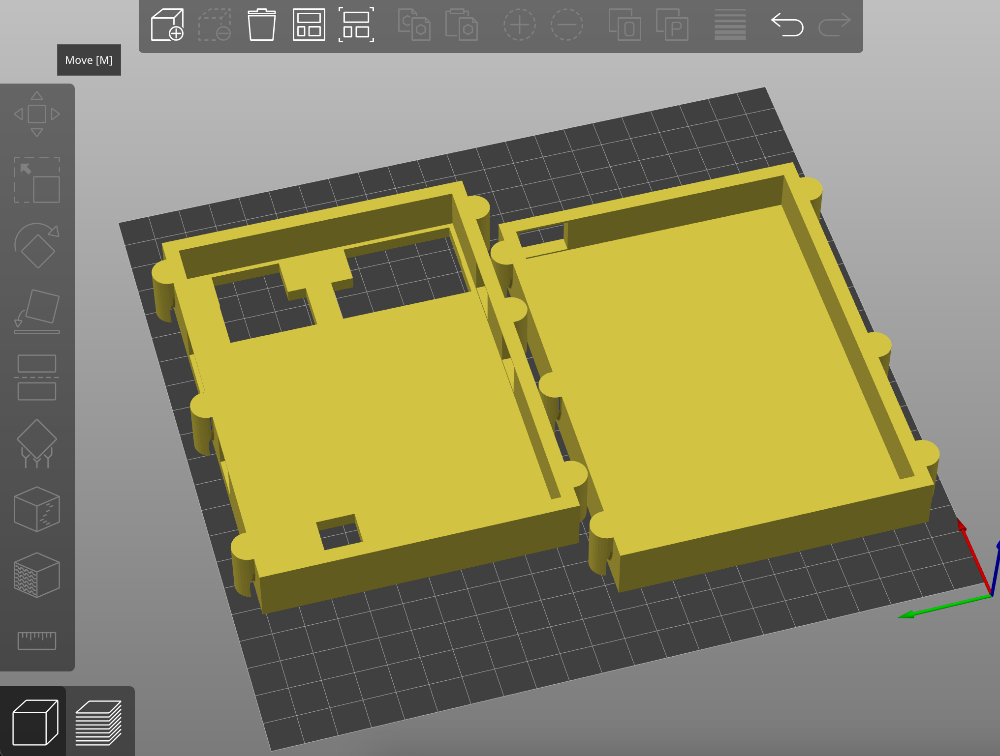

# 3D-Printed Case

## Files

The following files are included in this directory:
- `case.blend`: Blender file for the 3D model, editable for customizations.
- `case.stl`: Ready-to-print STL file for the case.

---

## Printing Instructions

1. **Prepare the Model**:
   - Load `case.stl` into your slicer (e.g., [PrusaSlicer](https://www.prusa3d.com/prusaslicer/) or Cura).

2. **Slice the Model**:
   - Horizontally slice the model into two halves at an appropriate plane.
   - Ensure that both halves are correctly oriented and positioned for printing.

3. **Print Settings**:
   - The case was printed using **PLA+** with all slicer parameters set to their defaults.

---

## Assembly Instructions

I just used rubber bands to hold the halves together.  There are six notches that can be used for this purpose.