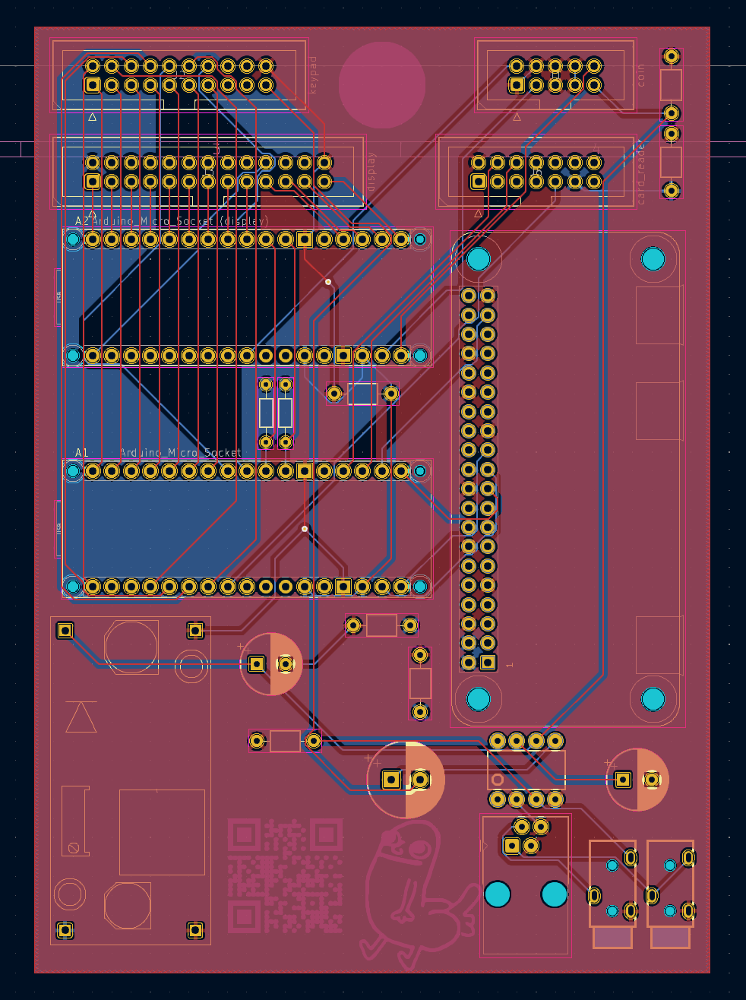
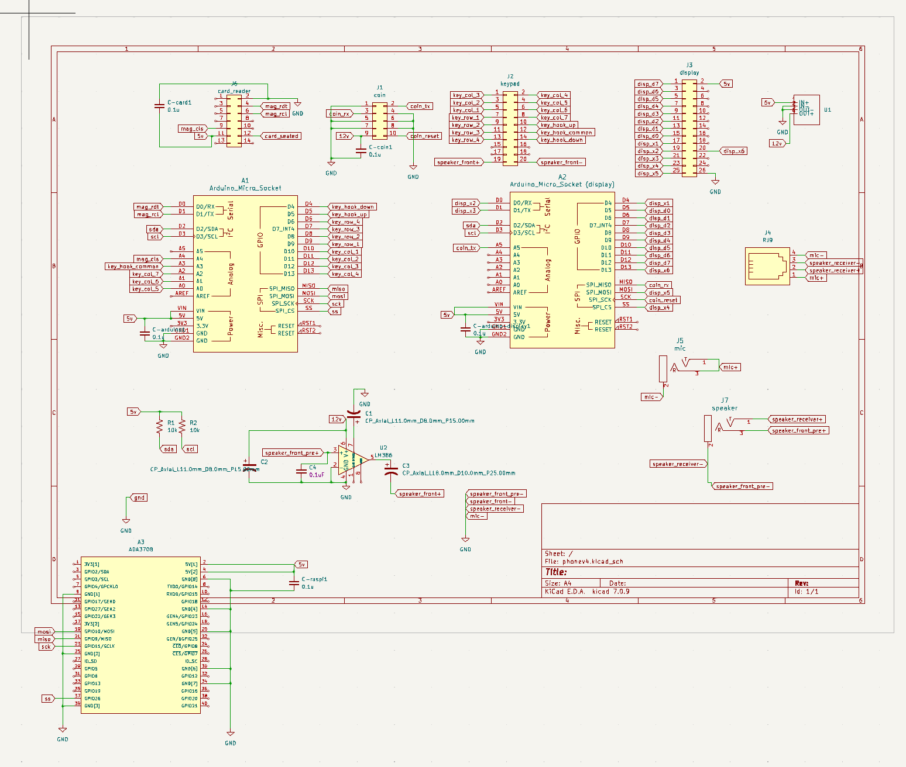

# PCB Design 

This directory contains the PCB design files, created with KiCad. The PCB integrates microcontrollers and other components into a compact layout.

## Files

- `phonev4.kicad_pro`: Main KiCad project file.
- Supporting KiCad files (e.g., schematic, PCB layout).
- Exported Gerber files for fabrication.

## Usage

1. **Edit the Design**:
   - Open `phonev4.kicad_pro` in [KiCad](https://www.kicad.org/).

2. **Export Manufacturing Files**:
   - Use KiCad's `Plot` and `Generate Drill Files` tools to export updated Gerber files as needed.

## Manufacturing

- The Gerber files were uploaded to [JLCPCB](https://jlcpcb.com) for fabrication.
- To replicate:
  - Log in to JLCPCB and upload the Gerber files during the order process.
  - Verify the layer previews in JLCPCB's tool before finalizing the order.